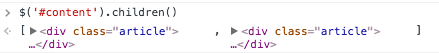
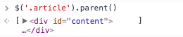
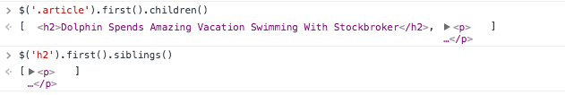

#jQuery Basics

The jQuery library provides hundreds of methods for interacting with an HTML page. If you are looking for something in particular, check out the [jQuery Cheatsheet](http://oscarotero.com/jquery/), which lists methods by category.

You will practice the essential methods in this prework, but don't worry about memorizing  - you'll always be able to look up the syntax when you need to.

##Objectives
This lesson will explain
* DOM Selection
* Filtering
* DOM Traversal (Moving around the DOM)
* Adding and Removing DOM Elements
* Using jQuery to Modify CSS

## Selection and the DOM
The first step in using jQuery is being able to navigate the DOM to select the elements to be acted upon.  You can select DOM elements by using the following  jQuery syntax:

```js
$(selector).action()
```

* the selector, familiar to us from CSS,  is the criterion you are matching against. The selector can query for HTML elements, CSS classes or ids, or select the entire document.
* .action() is a jQuery method
* the `$` indicates that that .action() is a jQuery method, to be accessed from the jQuery source file.

The following code would hide all paragraph tags.

```javascript
$("p").hide();
```
In fact, if you open up Twitter, and paste that code into the console, you'll see the tweets disappear. Using the jQuery method, `show()`, you can quickly resurrect those tweets.

jQuery selector syntax is very similar to CSS syntax, except that selectors are wrapped in quotes.

|CSS/HTML          |jQuery           |Selected        |
|---          |---              |---             |
|p            |$('p')           |All the paragraph elements|
|div          |$('div')         |All the div elements|
|.button      |$('.button')     |All elements with class=”button”|
|#headline    |$('#headline')   |The element with id=”headline”|
|.code strong |$('.code strong')|all of the strong elements with parent elements with the class="code"|
|header nav li.home|$('header nav.home')|All the li elements inside navs inside headers with the class home'|

##Filtering
jQuery has some great methods for choosing the particular elements you want from a set of them. For example `first()` and `last()` will select the bookends within your subset while `.eq(index)` will select the element at a certain index. You should chain methods by first filtering the elements, then applying the action to them.

The code below selects the fifth tweet and changes the text within. Try it out in Twitter.

```js
$( "p" ).eq( 5 ).text('Make Love Not War')
```

##DOM Traversal(Movement)
The DOM represents a page in a hierarchy, like a tree. Each object in the DOM is a node - the document itself, each HTML element and each block of text is a node. Just like a family tree, we describe relationships using children, parent and sibling. Any elements inside of another element are children. Conversely, an element that contains other elements is a parent element. Siblings are the other elements with the parent element.

It's a lot easier to talk about parents/children/siblings when you can actually see the markup, so for this section we'll be referring to the HTML below. To code-along, open up the `odd_news.html` file in your browser. You can do this via the command line or via the GUI (for example, Finder in iOS).

```html
<head>
  <title>The Onion</title>
  <link rel="stylesheet" href="css/style.css">
  <script src="https://ajax.googleapis.com/ajax/libs/jquery/1.12.0/jquery.min.js"></script>
</head>
<body>
  <h1 class="small-caps">The Onion</h1>
  <div id="content">
    <div class="article">
      <h2>Dolphin Spends Amazing Vacation Swimming With Stockbroker</h2>
      <p><strong>ORLANDO, FL</strong> - Describing the encounter as a once-in-a-lifetime experience she'll never forget, local bottlenose dolphin Hazel reportedly recounted stories Tuesday from a recent vacation in which she got to go swimming with a stockbroker.
      </p>
    </div>
    <div class="article">
      <h2>Archaeological Dig Uncovers Ancient Race Of Skeleton People</h2>
      <p><strong>AL JIZAH, EGYPT</strong> A team of British and Egyptian archaeologists made a stunning discovery Monday, unearthing several intact specimens of "skeleton people"—skinless, organless humans who populated the Nile delta region an estimated 6,000 years ago.
      </p>
    </div>
  </div>
</body>
```

With proper indentation, the relationships between parents, children and parents becomes clear.

The two `.article` divs are children of the `#content` div.



Conversely, the `#content` div is a parent to the `.article` divs.



That first `.article` div has two children, an H2 and a paragraph, and those two elements are siblings.




These three methods, `children()`, `parent()`, and `siblings()`allow you to select an element that may not have any distinguishing characteristics, such as an id or a specific class.


##Adding and Removing Elements
You can use jQuery to add an element dynamically with `append()` or remove and element with `remove()`.
Try the code below to add a final sentence to each paragraph of The Onion and to remove the header.
```
$('p').append('Unbelievable!')
```
And to remove an element:
```
$('h1').remove()
```


## JQuery and CSS
In addition to modifying HTML, JQuery also works to change the style of a page. Here are some methods you can use to edit your CSS with JQuery:

* addClass() - Adds one or more classes to the selected elements
* removeClass() - Removes one or more classes from the selected elements
* toggleClass() - Toggles between adding/removing classes from the selected elements
* css() - Sets or returns the style attribute

To add the green class to the h2 elements:
```js
$('h2').addClass('green')
```

To search for any element with the small-caps class and remove it:
```js
$(".small-caps").removeClass("small-caps")
```

To add an id, there's no addId() method, but you can use the attr() method instead. Just pass the type of attribute (in this case "id") and the name of the attribute (in this case "big_headline") as parameters:
```js
$('h2').first().attr('id', 'big_headline');
```

You can use your newfound jQuery superpowers to wreak havoc within your browser, but because these files have already been locally loaded by the server, as soon as you refresh the page, you manipulations will be gone. To modify pages like Google, Facebook and Instagram you will first need to add jQuery via the javascript console. Unlike Twitter, those pages do not have links to the jQuery library.

The first line in the code below creates a new `<script>` element. Then the jQuery library is linked to that element. Finally, the last line finds the `<head>` element and adds our linked `<script>` element to it.

```js
var jq = document.createElement('script');
jq.src = "https://ajax.googleapis.com/ajax/libs/jquery/1/jquery.min.js";
document.getElementsByTagName('head')[0].appendChild(jq);
```
Happy pranking!
